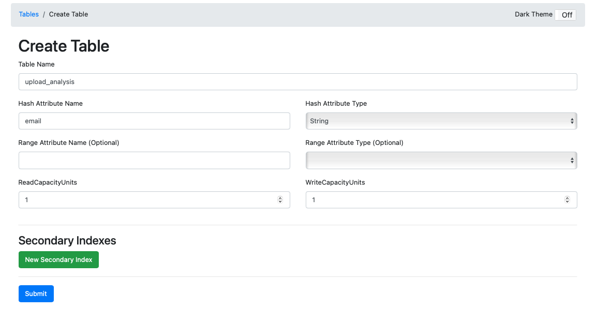
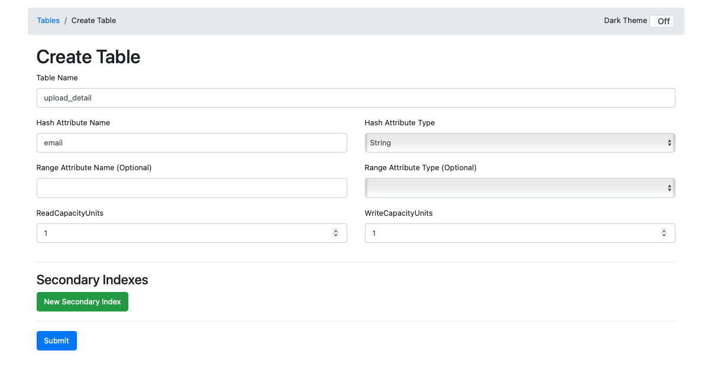

# netflix-data-analyzer
This project provides a UI to upload zip file which is received from Netflix. 
Once Uploaded, this application will analyze that file and show information in easy format.

# About personal information zip file from Netflix
Zip file of your personal information can be requested to Netflix from [here](https://www.netflix.com/account/getmyinfo)
Information about this file can be found [here](https://www.netflix.com/account/getmyinfo)

## What data is available in this zip file ?
- Account information
- Notification settings
- Privacy and Data Settings
- Access & device information
- Content Interaction History
- Profiles
- Payment and Billing Information

## How to run this application

### 1. Using docker
- Clone this repo and run `docker compose up --build`

### 2. Using IDE
- Clone this repo and run `mvn spring-boot:run`

## Dynamo DB setup in local (with Docker) - Run below commands in terminal
 - docker pull amazon/dynamodb-local  
 - docker run -p 8000:8000 amazon/dynamodb-local -jar DynamoDBLocal.jar -inMemory -sharedDb 
 - npm install -g dynamodb-admin 
 - dynamodb-admin --dynamo-endpoint=http://localhost:8000
 - Open dynamoDb admin at http://localhost:8001
 - Create these two tables with partition_key = email as below screenshots
   
   
